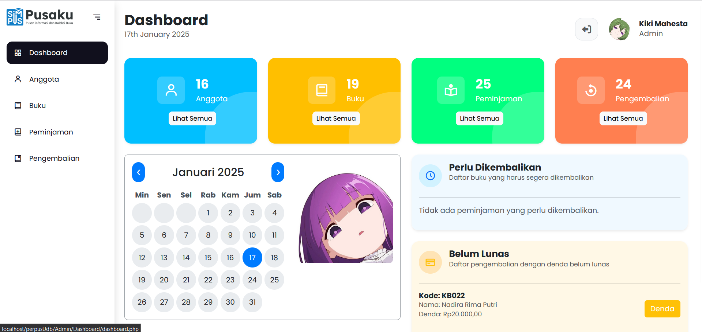

# 🌟 **Pusaku - Pusat Informasi & Koleksi Buku**

> Sistem Informasi Perpustakaan Modern untuk Universitas

---



## 📖 **Deskripsi Proyek**

**Pusaku** adalah sistem informasi berbasis web yang dirancang untuk mempermudah pengelolaan perpustakaan.  
Dibangun menggunakan **PHP Native** dan **Tailwind CSS**, proyek ini menawarkan solusi modern untuk manajemen perpustakaan.

### ✨ **Fitur Utama:**

- **Manajemen Buku**: Tambah, edit, dan hapus koleksi buku.
- **Peminjaman dan Pengembalian**: Kelola transaksi dengan mudah.
- **Pengelolaan Pengguna**: Mendukung 3 jenis pengguna dengan akses berbeda:
  - 👑 **Owner**: Pemilik sistem yang dapat menambahkan admin.
  - 🛠️ **Admin**: Mengelola buku, peminjaman, dan pengembalian.
  - 📚 **User**: Mahasiswa yang dapat meminjam buku.

---

## 🎯 **Fitur Lengkap**

### 👑 **Untuk Owner:**

- ✏️ Menambahkan, mengedit, dan menghapus akun admin.
- 📊 Melihat laporan peminjaman dan pengembalian buku secara keseluruhan.
- 📈 Mengelola data statistik perpustakaan.

### 🛠️ **Untuk Admin:**

- 📚 Menambahkan, mengedit, dan menghapus data buku.
- 🔄 Mengelola data peminjaman dan pengembalian buku.
- 👥 Melihat daftar peminjam aktif dan status pengembalian.
- 💰 Mengatur denda untuk pengembalian terlambat.

### 📚 **Untuk User:**

- 🔑 Melakukan registrasi dan login.
- 🔍 Mencari buku berdasarkan kategori, judul, atau penulis.
- 📖 Melihat detail buku (stok, deskripsi, tahun terbit).
- 📝 Mengajukan peminjaman buku.
- 📜 Melihat riwayat peminjaman dan status pengembalian.

---

## 🛠️ **Teknologi yang Digunakan**

| Teknologi      | Deskripsi                                              |
| -------------- | ------------------------------------------------------ |
| **Frontend**   | Tailwind CSS 3 + vanilla JS (`Assets/js/pusaku.js`)     |
| **Backend**    | PHP Native untuk pemrosesan data                        |
| **Database**   | MySQL (PDO) untuk penyimpanan data                      |
| **Server**     | Apache (XAMPP) atau hosting                              |

> Tidak ada framework CSS pihak ketiga. Semua ikon memakai SVG inline, dan
> perilaku interaktif (modal, dropdown, toast, konfirmasi) ditangani oleh
> `Assets/js/pusaku.js` — bukan Bootstrap JS.

### 🎨 **Design System**

Token & komponen kelas tersimpan di `Assets/css/pusaku.src.css`
(lapisan `@layer components`):

- **Tipografi** — `text-title`, `text-section`, `text-label`, `text-muted`
- **Permukaan** — `card-base`, `card-hover`, `stat-card`, `stat-icon`
- **Tombol** — `btn-primary`, `btn-secondary`, `btn-ghost`, `btn-danger`, `btn-warning`, `btn-sm`
- **Badge status** — `badge-available`, `badge-borrowed`, `badge-empty`, `badge-late`, `badge-due`, `badge-safe`, `badge-info`, `badge-neutral`
- **Form** — `field`, `field-label`, `field-select`, `field-textarea`, `check`, `switch-track`
- **Modal** — `modal-root`, `modal-panel`, `modal-header`, `modal-body`, `modal-footer`
- **Tabel & navigasi** — `table-base`, `page-link`, `page-link-active`
- **Status** — `empty-state`, `skeleton`, `code-chip`, `dl-row`, `divider`, `autocomplete-item`

Penggunaan komponen JS lewat atribut data (tanpa inisialisasi manual):

```html
<button data-modal-open="modalBuku">Buka</button>
<button data-dropdown-toggle="menuFilter">Filter</button>
<input data-table-search="#tabelBuku" />
<button data-confirm="Yakin hapus?">Hapus</button>
```

Helper global dari `window.Pusaku`:

```js
Pusaku.toast('Tersimpan', 'success');
await Pusaku.confirm({ judul: 'Hapus Buku', pesan: 'Tindakan ini permanen.' });
Pusaku.loadInto('#modalContent', 'add_buku.php');
```

### 🛠️ **Build CSS**

`Assets/css/pusaku.css` adalah hasil build Tailwind dan **sudah di-commit**,
sehingga deploy tidak wajib menjalankan npm. Setelah mengubah kelas di
template atau `pusaku.src.css`, bangun ulang dengan:

```bash
npm install
npm run build:css    # sekali jalan
npm run watch:css    # mode watch saat sedang developing
```

---

## 🔐 Login Terpadu

Seluruh aplikasi memakai **satu halaman login** di `/login.php`. Tidak ada
pemilihan role: pengguna cukup mengetik **username atau NIM + password**,
lalu sistem (`Config/Services/Auth.php`) memeriksa tabel `owner`, `petugas`,
dan `anggota` secara berurutan dan mengarahkan ke dashboard yang sesuai.

| Deteksi    | Sesi yang dibuat             | Tujuan                       |
| ---------- | ---------------------------- | ---------------------------- |
| `owner`    | `id_owner`, `nama_pemilik`   | `Owner/Dashboard/dashboard.php` |
| `petugas`  | `id_petugas`, `nama_petugas` | `Admin/Dashboard/dashboard.php` |
| `anggota`  | `nim`, `nama`                | `User/home.php`              |

- **Logout**: satu file tunggal `/logout.php`. Sidebar Admin/Owner memakai
  `$urlLogout` (`../../logout.php`, karena halamannya dua level di bawah
  root); header User memakai `../logout.php` (satu level).
- URL lama (`Admin/Layouts/login.php`, `Owner/Layouts/login.php`,
  `User/login.php`, `index.php`) **tetap redirect** ke `/login.php` supaya
  bookmark lama tidak 404.
- `Auth::attempt()` mengembalikan pesan error generik agar tidak
  membocorkan apakah sebuah username/NIM terdaftar.

> **Catatan username ganda.** Bila username yang sama dipakai di lebih dari
> satu tabel (mis. `petugas` dan `owner`), prioritasnya `owner` > `petugas`
> > `anggota`. Sebaiknya username dibuat unik lintas tabel.

### 🧪 Menjalankan test autentikasi

`tests/AuthFlowTest.php` menguji alur ini lewat HTTP sungguhan:

```bash
php -S 127.0.0.1:8862 -t .            # terminal 1
php tests/AuthFlowTest.php 8862        # terminal 2
```

---

## 📁 **Struktur Folder**

```plaintext
Perpustakaan/
├── login.php                 # SATU form login untuk semua peran
├── logout.php                # SATU file logout untuk semua halaman
├── index.php                 # Redirect ke login.php
├── Config/
│   ├── bootstrap.php         # Autoloader, session hardening, auth guard, CSRF
│   ├── koneksi.php           # Koneksi PDO MySQL
│   ├── layouts/              # Shell bersama: shell_start/end, auth_start/end
│   └── Services/             # Auth, DendaService, KodeTransaksi, ReminderService, dll
├── Admin/                    # Panel petugas (staf)
│   ├── Anggota/ Buku/ Peminjaman/ Pengembalian/ Dashboard/ Layouts/
├── Owner/                    # Panel pemilik (super-admin, mostly read-only)
│   ├── Admin/ Anggota/ Buku/ Peminjaman/ Pengembalian/ Dashboard/ Layouts/
├── User/                     # Panel anggota / mahasiswa
├── Assets/
│   ├── css/pusaku.src.css    # Sumber design system (input Tailwind)
│   ├── css/pusaku.css        # Hasil build (di-commit)
│   ├── js/pusaku.js          # Komponen JS vanilla
│   ├── img/                  # Logo & ilustrasi
│   ├── uploads/              # Cover buku & foto profil (runtime)
│   └── Anime Date/           # Ilustrasi kalender dashboard
├── Cron/reminder.php         # Cron: pengingat keterlambatan
├── tests/                    # DendaServiceTest, AuthFlowTest, ProfilTest
├── tailwind.config.js
└── package.json
```

> **Catatan:** folder `Database/` (skrip SQL schema & migrasi) sengaja tidak
> disertakan. Siapkan database sendiri, lalu sesuaikan `Config/koneksi.php`.

> Catatan: `Admin/Layouts/login.php`, `Owner/Layouts/login.php`, dan
> `User/login.php` kini hanya redirect ke `/login.php` (diposalkan).

---

## 🔐 **Akun & Peran**

Tiga peran, masing-masing punya panel dan menu sendiri. Semuanya masuk
lewat **satu halaman login** yang sama (lihat bagian *Login Terpadu*).

| Peran     | Halaman tujuan setelah login   | Session key      |
| --------- | ------------------------------ | ---------------- |
| **Owner** | `Owner/Dashboard/dashboard.php` | `id_owner`       |
| **Admin** | `Admin/Dashboard/dashboard.php` | `id_petugas`     |
| **User**  | `User/home.php`                 | `nim`            |
